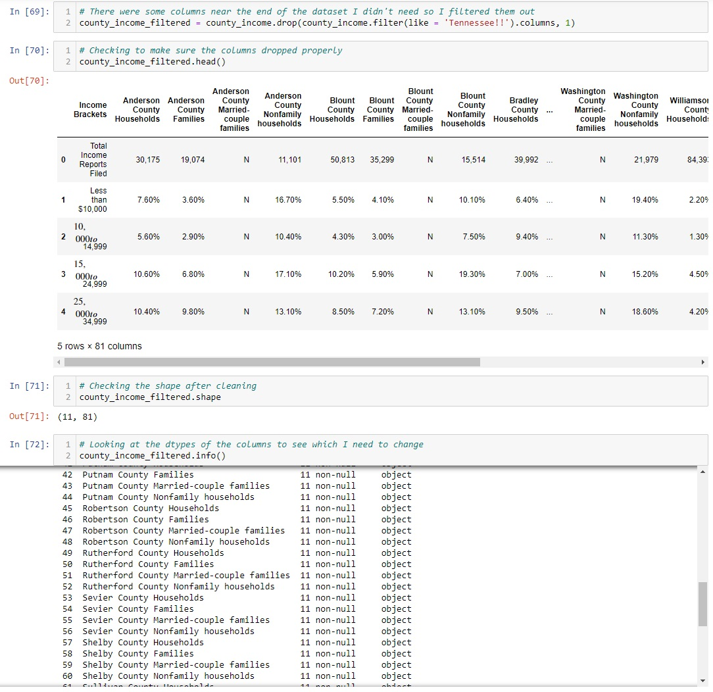
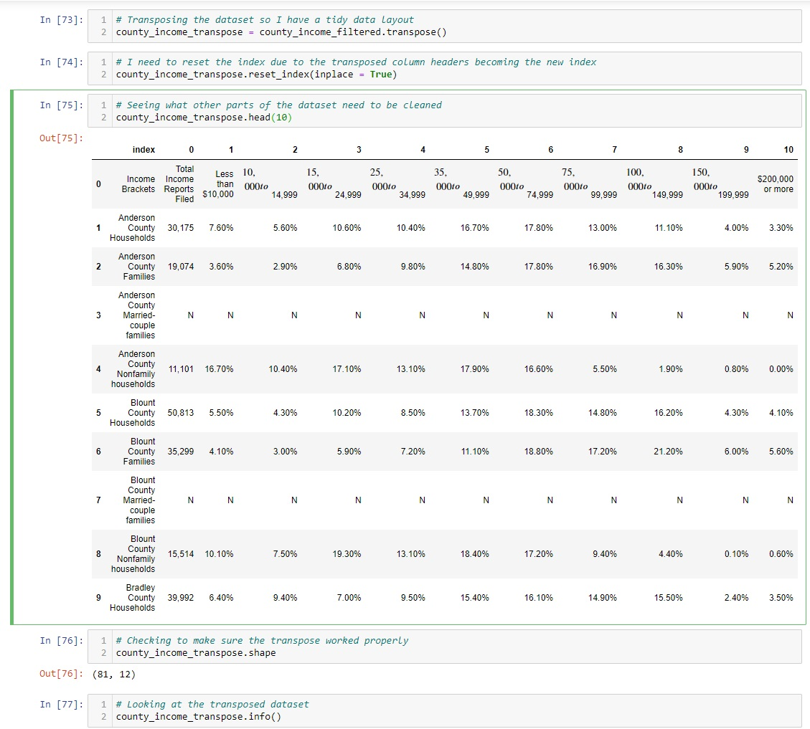
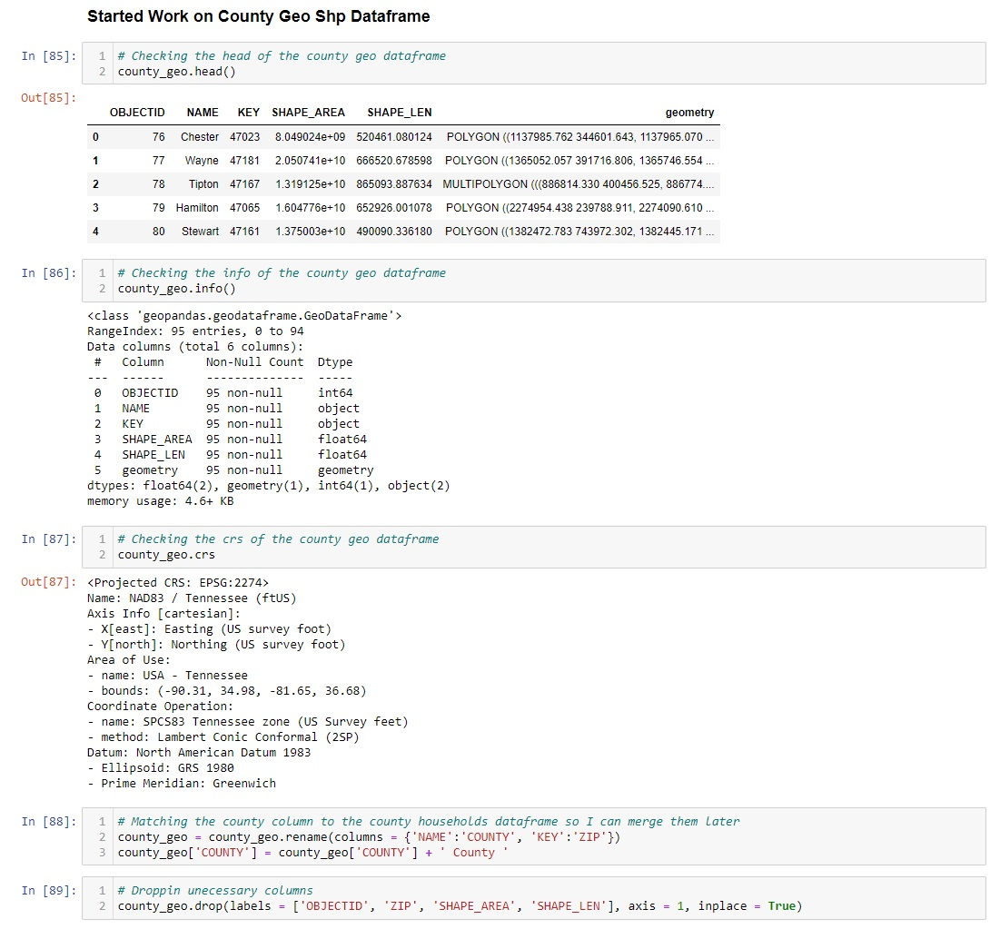

# income-brackets-tn

# Introduction
For this project I wanted to explore Tennessee population data and Tennessee income data to see what insights I could find.

Data Sources:  [Tennessee Population Data](https://www.census.gov/data/tables/time-series/demo/popest/2010s-counties-total.html#par_textimage) 
[Tennessee Income Data](https://data.census.gov/cedsci/table?q=income&g=0400000US47,47.050000&y=2019&tid=ACSST1Y2019.S1901&hidePreview=true&moe=false)

# Table of Contents
* [Introduction](#Introduction)
* [Python Walkthrough](#Python-Walkthrough)
* [Presentation Walkthrough](#Presentation-Walkthrough)

# Python Walkthrough

1. For the first step I installed all the packages required for the project, along with reading in the shp and csv files.

2. In the second step I checked the shape of the dataset along with looking at the head and tail to see the data structure I'm working with. It appears that the rows and columns aren't in the best order.

3. For the third step, I saw that there were rows I didn't need along with text in the columns that was unecessary so I removed both rows and the text.

4. The income dataset came with a full column with Tennessee income data, but for my use case I wanted the whole dataset to be county specific. I then filtered out the columns mentioned along with checking the county income filtered dataframe's info to see what datatypes the columns were.

5. In pandas there is an option to transpose your dataframe so that the columns become rows and the rows become columns. For this dataset it seemed appropriate. Checking the shape, info, and head of the dataframe along the way.

6. Next I needed to make the county column my index column and create a county income dataframe only for households. After creating the dataframe I cleaned up the county column so that it matched the other dataframes.

7. The next step was working on the county geo dataframe. I checked the head of the dataframe and the info. Afterwards I renamed some of the columns and removed columns I wasn't going to need for the project.

8. Since some counties were not covered in the Tennessee income dataset, I needed to create a list of available counties and filter the other dataframes through it using query in pandas.

9. Repeated step eight to clean up the other dataframes before finally combining all three datasets into a final dataframe.

10. Lastly I experimented with charts inside of python before exporting the geodataframe for visualization in Tableau.

# Presentation Walkthrough

1. 

2. 

3. 

4. 

5. 